# TGN Chat — Design Document

A reference design for a **self-hosted, hybrid-retrieval RAG chatbot over a private corpus**, powered entirely by local inference (LM Studio) with no third-party API dependency.

This document is written for two audiences at once:

1. The maintainer of this specific deployment (a chatbot over ~380 episodes of *The Grey NATO* podcast).
2. **Evaluators who want to adapt the approach to their own datasets.** Wherever the design is corpus-specific, a *"Adapting to your dataset"* note calls out what changes.

The thesis being evaluated: **you can build a genuinely useful retrieval-augmented chatbot over a domain corpus on commodity hardware, with no cloud LLM, no vector-DB SaaS, and no per-query cost** — and the only "server" component is a single Python file plus a reverse proxy.

---

## 1. Executive summary

| Property | This deployment |
|---|---|
| Corpus | 380 podcast episodes, ~10 years, speaker-attributed transcripts + synopses + 7,663 curated links |
| Chunks | 8,591 (380 synopsis + 380 links + 7,831 transcript) |
| Embedding model | `bge-m3` (1024-dim dense), run locally in LM Studio |
| Generation model | Local chat model in LM Studio (default `gpt-oss-120b`; user-selectable) |
| Retrieval | **Hybrid**: sqlite-vec KNN (dense vectors) + SQLite FTS5 BM25 (keyword), merged and re-ranked |
| Store | A single SQLite file (`podcast.db`, 161 MB) holding text, vectors, and the FTS index |
| Backend | One Python file (`web/serve.py`, stdlib `http.server`) on `:5555` |
| Frontend | Vanilla JS + water.css, **no build step**, served as static files |
| Edge | Caddy reverse proxy on `:8080` fanning out to LM Studio, the search API, and static files |
| External dependencies at runtime | **None.** No OpenAI, no Pinecone, no cloud. Everything is `127.0.0.1`. |
| Per-query cost | $0 (electricity only) |

### Key design decisions

- **SQLite is the entire database.** Episodes, chunks, dense vectors (`sqlite-vec` `vec0` virtual table), and the keyword index (`fts5`) all live in one file. No separate vector DB, no Postgres, no Elasticsearch.
- **The LLM never leaves the machine.** LM Studio exposes an OpenAI-compatible API on `localhost:1234`; Caddy proxies `/v1/*` to it so LAN clients work without LM Studio binding to `0.0.0.0`.
- **Hybrid retrieval, not pure vector.** Dense embeddings find semantic matches; FTS5/BM25 catches exact proper nouns (watch references, people, place names) that embeddings often blur. The two result sets are merged with a deliberately simple distance-based re-rank.
- **No frontend build.** `<script>` tags only. The chat UI, streaming, and citation rendering are ~700 lines of vanilla JS.
- **The ingest pipeline is model-agnostic.** It emits one `.db` per embedding model so you can A/B retrieval quality (`eval.py`).

---

## 2. System architecture

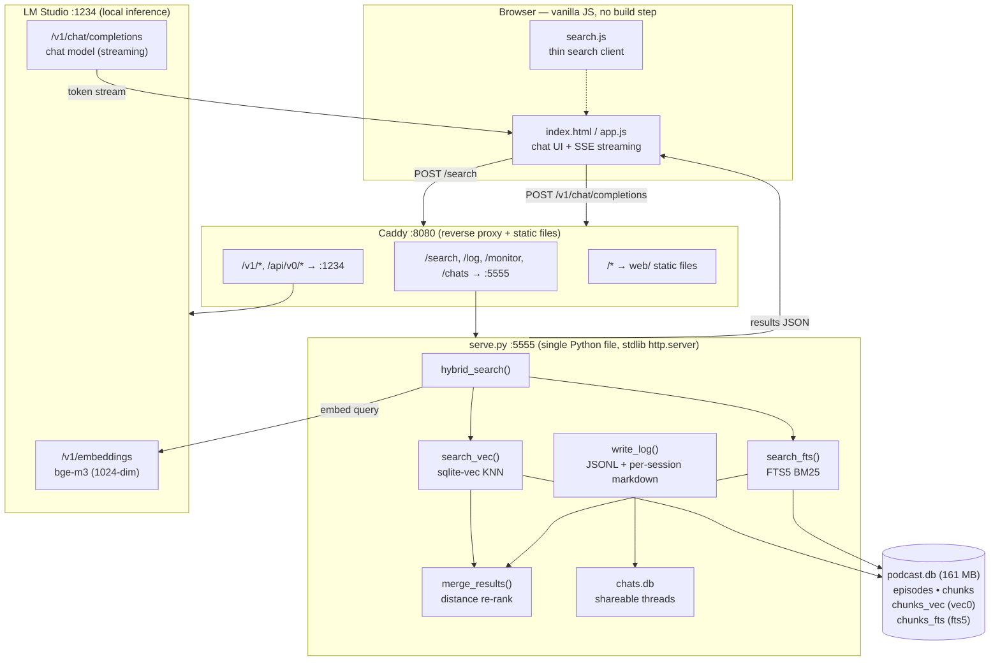

### Request lifecycle (a single question)

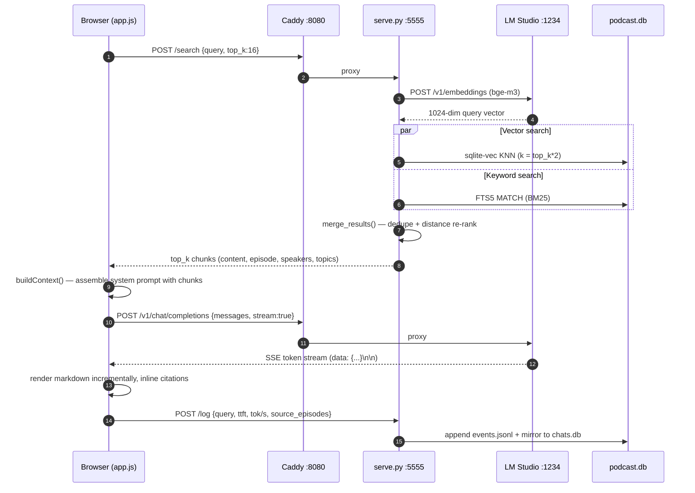

Two things worth noting:

- **The browser orchestrates generation, the server orchestrates retrieval.** `serve.py` only does search + logging. The actual chat call goes browser → Caddy → LM Studio directly, so streaming tokens never round-trip through the Python server.
- **Query embedding uses the same model the corpus was embedded with.** `serve.py` reads `embedding_model` from the DB's `meta` table at startup, so the query vector and the stored vectors are always in the same space.

---

## 3. Data model

A single SQLite database is the whole store. Four logical pieces: episode metadata, chunk text, dense vectors, and the keyword index.

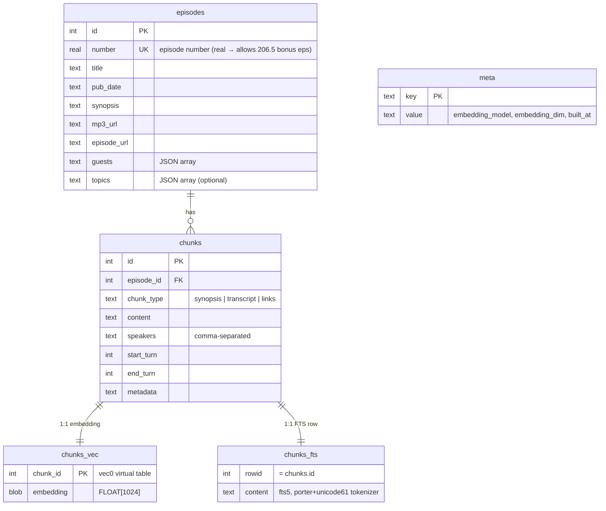

Notes:

- **`chunks_vec`** is a `sqlite-vec` `vec0` virtual table. KNN is `WHERE embedding MATCH ? AND k = ?`.
- **`chunks_emb`** (not shown) holds the same vectors as a plain `BLOB` table — a brute-force fallback for browsers/runtimes without the `vec0` extension. The current deployment does server-side search, so this is belt-and-suspenders.
- **`chunks_fts`** uses the `porter unicode61` tokenizer (stemming + Unicode folding). `content_rowid='id'` ties FTS rows back to `chunks` for free joins.
- **`meta`** makes the DB self-describing: `serve.py` discovers the embedding model and dimension at load time rather than hard-coding them.

> **Adapting to your dataset:** the `episodes` table is really a *document* table and `chunks` is a *passage* table. Rename mentally to `documents` / `passages`. The only structural requirement is: each chunk knows its parent document and carries enough metadata to render a citation. Everything corpus-specific (speakers, episode numbers, pub_date) is just columns you can swap.

---

## 4. Ingest pipeline

The pipeline is four stages, each a standalone script that reads the previous stage's output. This makes it restartable and model-swappable.

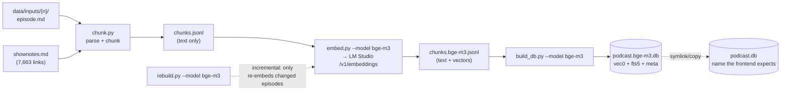

### Stage 1 — `chunk.py`: source → structured chunks

`episode.md` is the single source of truth. It has YAML frontmatter, a synopsis section, a links section, and the transcript as a pipe-delimited markdown table with speaker attribution. `chunk.py` parses these sections and emits **three chunk types**:

| Chunk type | One per | Purpose | Sizing |
|---|---|---|---|
| **synopsis** | episode | "Which episode discussed X?" | the whole synopsis paragraph |
| **transcript** | ~500 words | conversational context with attribution | groups consecutive speaker turns until ≥500 words, breaking on turn boundaries |
| **links** | episode | "What was that website/watch/book?" | all curated shownotes links for the episode, one chunk |

Why these three types? They answer structurally different questions. Synopsis chunks are high-recall "table of contents" entries; transcript chunks carry the actual conversation; link chunks are a recommendation index. Each chunk also extracts **guests** (transcript speakers minus the known hosts, minus diarization artifacts like `SPEAKER_00`, `Music`, `Unknown`).

> **Adapting to your dataset:** chunking is the single highest-leverage decision in RAG. The pattern here — *type your chunks by the kind of question they answer, and let natural structure (speaker turns, sections, paragraphs) set the boundaries* — generalizes well. ~500 words (~650 tokens) is a good default transcript chunk; tune to your embedding model's optimal input length and your document structure.

### Stage 2 — `embed.py`: chunks → vectors

Calls LM Studio's OpenAI-compatible `/v1/embeddings` one chunk at a time, appends the vector to each JSONL row. It is **resumable**: on restart it counts already-written output lines and skips them, so a 8,591-chunk embedding run that dies at chunk 6,000 picks up where it left off. Output filename encodes the model (`chunks.bge-m3.jsonl`) so multiple models coexist.

### Stage 3 — `build_db.py`: vectors → SQLite

Creates the schema, inserts episodes (pulling `mp3_url`/`episode_url` from each `episode.json`), inserts chunks, and writes each vector into **both** `chunks_vec` (vec0) and `chunks_emb` (plain blob fallback) plus the FTS5 index. Embedding dimension is auto-detected from the first row, so the same script builds 384-dim or 1024-dim DBs unchanged. Stamps `meta` with model, dim, and `built_at`.

### Stage 4 — `rebuild.py`: incremental updates

For ongoing operation (a podcast publishes new episodes), `rebuild.py` re-chunks and re-embeds **only changed/new episodes** instead of the full ~8,600-chunk run. This is what you cron after `sync.sh` pulls new transcripts.

> **Adapting to your dataset:** the only LM Studio dependency in ingest is the `/v1/embeddings` call. Point `LM_STUDIO_URL` at any OpenAI-compatible embeddings endpoint (or swap in `sentence-transformers` locally) and the rest is unchanged.

---

## 5. Retrieval — hybrid search

This is the heart of the system. Pure vector search misses exact terms; pure keyword search misses paraphrases. The design runs both and merges.

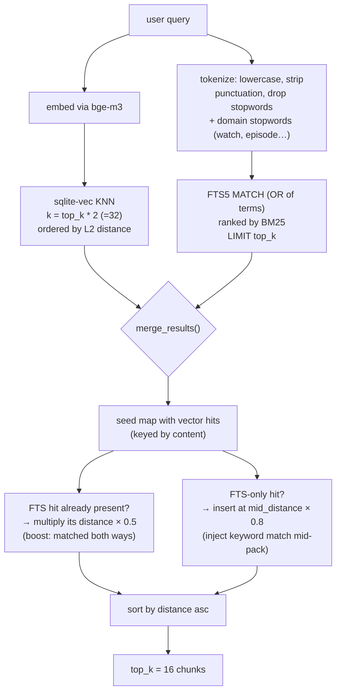

### How the merge works (`merge_results`)

1. **Seed** a map with the vector results, keyed by chunk content, remembering each one's rank.
2. **Compute `mid_distance`** — the distance of the chunk at the middle of the vector result list. This is the anchor for injecting keyword-only hits.
3. **For each FTS hit:**
   - If it's *already* in the vector results → halve its distance (`× 0.5`). A chunk that matched **both** semantically and lexically is almost certainly relevant, so it gets promoted.
   - If it's FTS-*only* → insert it at `mid_distance × 0.8`, i.e. slightly better than the median vector hit. Keyword matches earn a respectable-but-not-top slot.
4. **Sort** by (adjusted) distance, return `top_k = 16`.

This is intentionally a **heuristic, not a learned re-ranker**. It's transparent, has zero added latency, and is easy to reason about. The two knobs (`0.5` boost, `0.8` injection) are the obvious tuning surface.

> **Why not Reciprocal Rank Fusion (RRF)?** RRF is the textbook hybrid-merge and a reasonable next step. The current distance-blend was chosen for legibility — you can read the four lines of `merge_results` and predict the ranking. If you adapt this and find the heuristic brittle on your corpus, swapping in RRF is a ~10-line change and a natural A/B candidate. *(See §10 roadmap.)*

### FTS query construction

The query is lowercased, split on whitespace/dashes, stripped of punctuation, and filtered against a stopword list that includes **domain stopwords** — `watch`, `watches`, `episode`, `brand`, `show`. (In a watch podcast, "watch" is in nearly every chunk, so it carries no signal.) Remaining tokens become an `OR` query. This is the cheapest, highest-impact corpus customization in the whole system.

> **Adapting to your dataset:** replace the domain stopwords with the words that are ubiquitous *in your corpus specifically*. For a legal corpus that might be "court", "case", "plaintiff"; for internal docs, your company name. One line, big precision win.

---

## 6. Generation

Generation happens **client-side** — `app.js` assembles the prompt and streams directly from LM Studio. The retrieved chunks become a `Retrieved context:` block in the system prompt.

### Prompt assembly (`buildContext` + `generateResponse`)

Each retrieved chunk is rendered as:

```
[Episode 206: Title, March 2021] (James Stacy, Jason Heaton)
Topics: dive watches, travel
<chunk content>
```

…joined by `---` separators and embedded in a system prompt that instructs the model to:

- give detailed answers with specific quotes, names, dates;
- **cite episodes inline as markdown links** (`[206](https://tgn.phfactor.net/206/episode/)`);
- discuss each relevant episode;
- admit when the retrieved context is thin — but **not** speculate about what is/isn't in the database (the model only sees excerpts, not the whole archive, and shouldn't reason about coverage from a partial view).

The message array is `[system, ...last 2 exchanges, user]` — a 4-message conversational window so follow-ups have context without unbounded prompt growth.

### Streaming

`fetch()` + `ReadableStream`, parsing LM Studio's OpenAI-compatible SSE (`data: {...}\n\n` lines, reading `choices[0].delta.content`). `stream_options: {include_usage: true}` returns token counts in the final chunk. The UI renders markdown incrementally with `marked`, and records **TTFT** (time to first token) and **tokens/sec** for every response — surfaced in the monitoring dashboard.

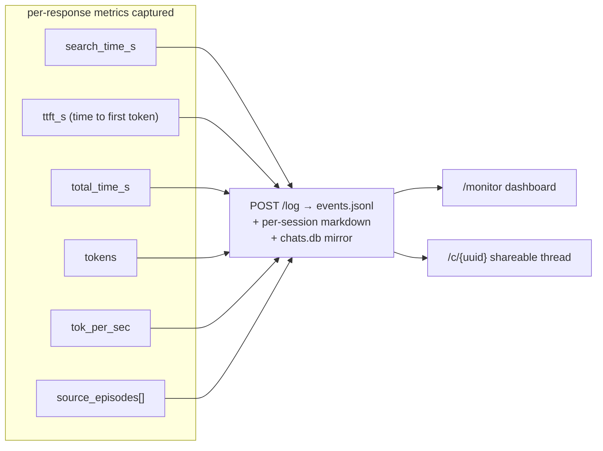

> **Adapting to your dataset:** the system prompt is the other big corpus-specific surface (alongside chunking and stopwords). Rewrite the persona, the citation format, and the "don't speculate about coverage" guardrail for your domain. The citation-as-markdown-link pattern is worth keeping — it turns every answer into a navigable index back into your source material.

---

## 7. Deployment topology

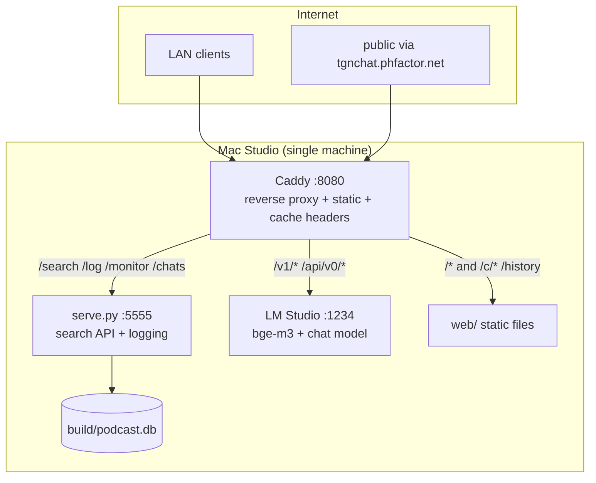

Everything runs on one Mac Studio. Caddy is the only thing that needs to be reachable; LM Studio binds to `127.0.0.1` only and is reached exclusively through the proxy (which strips `Origin` and rewrites `Host` to dodge CORS and host-check issues).

### Caddyfile routing (actual)

| Path | Upstream | Why |
|---|---|---|
| `/v1/*`, `/api/v0/*` | LM Studio `:1234` | embeddings, chat completions, model state |
| `/search`, `/search/*`, `/log`, `/monitor*`, `/chats*` | serve.py `:5555` | retrieval + logging + dashboards |
| `/c/*` | rewrite → `/index.html` | shareable chat URLs (SPA reads UUID from path) |
| `/history` | rewrite → `/history.html` | chat history page |
| `/*` | `web/` static | the app |

`*.html`, `*.js`, `*.css` and the SPA routes are served with `Cache-Control: no-cache` so iteration doesn't require hard-reloads.

> **Running it yourself** — see [README.md](../README.md). In short:
> ```bash
> pip install -r ingest/requirements.txt
> ./ingest/sync.sh                      # pull source episode data
> python ingest/rebuild.py --model bge-m3   # build/refresh the DB
> python web/serve.py &                 # search API on :5555
> caddy run                             # reverse proxy on :8080
> ```
> Requires LM Studio running on `127.0.0.1:1234` with `bge-m3` (embedding) and a chat model loaded. The `data/` directory (~1 GB source transcripts) is not in git.

---

## 8. Observability

Every query is logged three ways, all local:

1. **`events.jsonl`** — append-only structured log; the monitoring dashboard's source of truth and the substrate for offline analysis.
2. **Per-session markdown** (`logs/YYYY-MM-DD_{short_id}.md`) — human-readable transcripts with a metrics table per query (search time, TTFT, total time, tokens, tok/s, source episodes). Nice for eyeballing real usage.
3. **`chats.db`** — a separate SQLite DB mirroring queries into `chats`/`messages` tables, powering **shareable chat URLs** (`/c/{uuid}`) and the **history page**.

A live dashboard at `/monitor` polls `events.jsonl` (in-memory ring buffer of the last 200 events for live tailing, full file for history). 👍/👎 feedback is captured per `query_id`, so you can build an eval set from real thumbs-down queries.

---

## 9. Evaluation methodology

The pipeline emits **one `.db` per embedding model**, so retrieval quality is directly comparable.

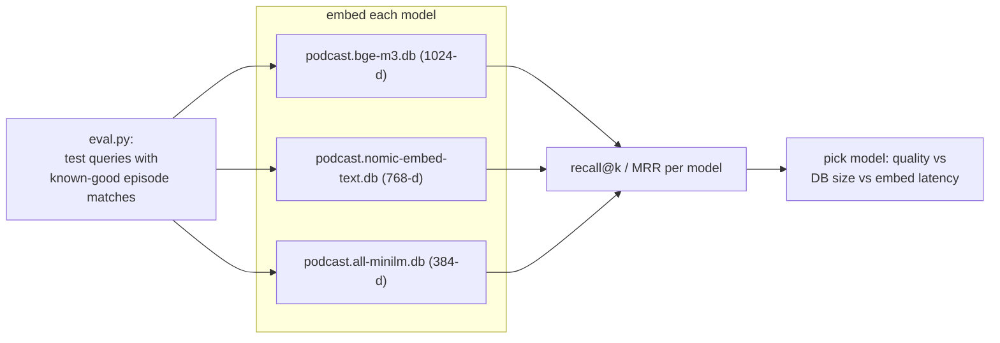

`eval.py` runs a fixed set of test queries, each with a known-good episode, and reports recall across models. The trade space:

| Model | Dim | DB size (this corpus) | Notes |
|---|---|---|---|
| `all-minilm` | 384 | smallest | fast baseline |
| `nomic-embed-text` | 768 | medium | strong general-purpose |
| `bge-m3` | 1024 | 161 MB (**chosen**) | best on proper nouns (watch/people names), dense+sparse-aware |

For a corpus dense with proper nouns (watch references, brand names, guest names), `bge-m3` won — which is also *why* hybrid search matters here: even the best dense model benefits from BM25 backstopping exact terms.

> **Adapting to your dataset:** this is the part you should run first. Build 2–3 DBs, write ~20 test queries with known-good documents from your corpus, and let `eval.py` tell you which embedding model to ship. Then layer in the thumbs-down queries from real usage (§8) as a growing regression set.

### Recommended evaluation protocol for the two pilot datasets

1. Get each dataset into the `data/inputs/{id}/` shape (one source doc per directory). The only hard requirement is a parseable source file per document.
2. Adapt `chunk.py`'s parser to your source format (this is the main porting work — see §11).
3. Build DBs for `bge-m3` + one smaller model.
4. Author 20–30 eval queries with known-good docs; run `eval.py`; pick a model.
5. Rewrite domain stopwords (§5) and the system prompt persona (§6).
6. Pilot with real users; mine 👎 queries into the eval set; iterate chunking + merge knobs.

---

## 10. Performance characteristics

- **Storage:** ~19 KB/chunk all-in (text + 1024-d float32 vector + FTS), → 161 MB for 8,591 chunks. Linear in corpus size; a 100k-chunk corpus is ~2 GB, still trivially a single SQLite file.
- **Retrieval latency:** dominated by the **query-embedding round-trip to LM Studio**, not the SQLite search. KNN over <10k chunks and an FTS lookup are sub-millisecond; the embedding call is tens of ms. sqlite-vec does a linear scan (no ANN index) which is fine to ~10⁵–10⁶ vectors.
- **Generation latency:** the user-visible cost. TTFT depends on model load + prompt prefill; tok/s depends on the chat model and hardware. Both are measured per-response (§6) — there's a tracked work item to surface model-load/prefill progress during the wait (`memory: project_ttft_progress_ui`).
- **Concurrency:** `serve.py` is a single-threaded stdlib `HTTPServer` with one shared SQLite connection (`check_same_thread=False`). Fine for a handful of LAN users / a low-traffic public demo; **not** built for high concurrency. The honest scaling ceiling is LM Studio's single-GPU throughput anyway.

### Where this design stops scaling (be honest)

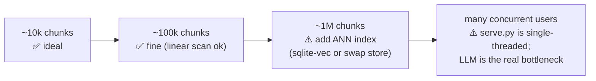

For the two pilot datasets, unless either is >100k passages or needs many simultaneous users, this architecture is comfortably in its sweet spot.

---

## 11. Adapting to a new dataset — checklist

The architecture is corpus-agnostic; only a few seams are corpus-specific.

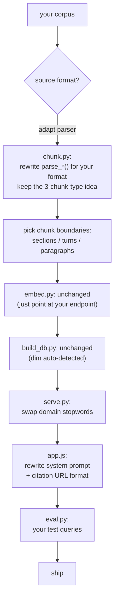

| Seam | File | Effort | Corpus-specific? |
|---|---|---|---|
| Source parsing & chunking | `chunk.py` | **High** (the real work) | ✅ entirely |
| Embedding | `embed.py` | None | ❌ |
| DB build | `build_db.py` | None | ❌ (dim auto-detected) |
| Domain stopwords | `serve.py` | Low | ✅ |
| Merge knobs | `serve.py` | Low (optional tuning) | partly |
| System prompt + citation format | `app.js` | Medium | ✅ |
| Eval queries | `eval.py` | Medium | ✅ |
| Schema columns (speakers, etc.) | `build_db.py` + `serve.py` | Low | partly |

**The 80/20:** ~80% of porting effort is `chunk.py` (parse your format, choose good boundaries) and the system prompt. Everything in the middle of the pipeline — embed, store, vector search, FTS, streaming — is dataset-independent.

---

## 12. Security & privacy posture

- **No data leaves the machine.** No cloud LLM, no embeddings API, no telemetry. For sensitive corpora (legal, medical, internal), this is the entire point — the model and the data are co-located on hardware you control.
- **LM Studio is not internet-exposed** — bound to `127.0.0.1`, reached only via Caddy, which strips `Origin` and rewrites `Host`.
- **Logs are local** and contain full query/response text. If you expose the chatbot publicly, treat `logs/` and `chats.db` as containing user queries.
- **No auth** in the current design. The public deployment is an open demo. For a private pilot, add Caddy `basicauth` or put it behind a VPN/Tailscale — a few lines in the Caddyfile.

---

## 13. Known limitations & roadmap

**Current limitations**

- Single-threaded search server; no auth; no rate limiting.
- Merge heuristic is hand-tuned, not learned or RRF-based.
- sqlite-vec linear scan — fine now, needs an ANN index past ~10⁶ vectors.
- Chunk-type retrieval is undifferentiated: synopsis/transcript/links compete in one ranked list with no per-type weighting.
- No reranker model between retrieval and generation.

**Natural next steps (good evaluation experiments)**

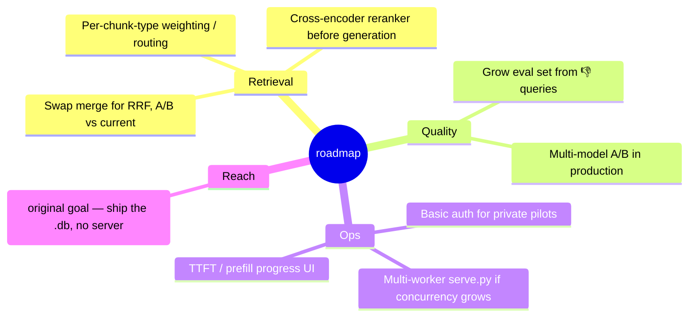

The original architecture goal (in `CLAUDE.md`) was **fully client-side search** via `sql.js` + `sqlite-vec` WASM — ship the 161 MB `.db` to the browser, cache in OPFS, and do retrieval with zero server. The current server-side `serve.py` was the pragmatic intermediate step (no 161 MB download). Both `chunks_vec` and the brute-force `chunks_emb` fallback already exist in the DB to support the WASM path, so the client-side variant remains a live option for a fully serverless deployment.

---

## Appendix A — file map

| File | Role |
|---|---|
| `ingest/chunk.py` | parse `episode.md` → 3 chunk types (JSONL) |
| `ingest/embed.py` | chunks → vectors via LM Studio (resumable) |
| `ingest/build_db.py` | JSONL → SQLite (vec0 + fts5 + meta) |
| `ingest/rebuild.py` | incremental re-embed of changed episodes |
| `ingest/eval.py` | recall comparison across embedding models |
| `ingest/sync.sh` | rsync source transcripts from the transcription box |
| `web/serve.py` | search API + hybrid search + logging + chats.db |
| `web/app.js` | chat UI, prompt assembly, SSE streaming, metrics |
| `web/search.js` | thin client for `/search` |
| `web/index.html` / `history.html` / `monitor.html` | UI pages |
| `Caddyfile` | reverse proxy + static + cache headers |

## Appendix B — the stack in one breath

Browser (vanilla JS) → Caddy → {**serve.py** for hybrid search over **SQLite** (`sqlite-vec` + **FTS5**), **LM Studio** for **bge-m3** embeddings and local chat generation}. One machine. One database file. No cloud. No build step. No per-query cost.
